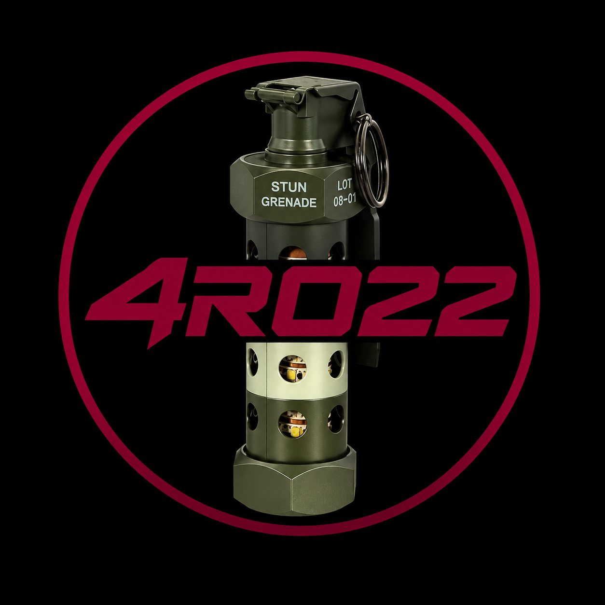

<p align="center">
  
</p>

<h1 align="center">4R022 FlashBang</h1>

<p align="center"><b>[Türkçe](#türkçe) | [English](#english)</b></p>

---

## Türkçe

Masaüstünde gerçekçi bir flashbang (stun grenade) efekti oynatan, Windows,
macOS ve Linux üzerinde çalışan bir 4R022 uygulaması.

### Özellikler

- Ortada büyük bir flashbang görseli; tıklandığında sıralı ses efekti
  (fırlatma sesi → patlama sesi) ve **tüm monitörleri** kaplayan gerçekçi,
  tam beyaz bir patlama efekti tetiklenir.
- Çok aşamalı, gerçekçi patlama animasyonu: anlık sıcak tonlu aşırı
  pozlama + kısa strob titreşimi, ardından sıcak "after-image" tonundan
  siyaha yumuşak geçişli (ease) bir sönüş.
- Patlama sesi **düz (yuvarlak) bir nadirlik skalasıyla** seçilir —
  oyunlardaki "roll" mekanikleri gibi. Gerçek flashbang sesleri en
  yüksek ihtimalle (havuzun geri kalanı, ~%97) çıkar; 10 adet "meme"
  sesi ise 1/100'den 1/100.000'e kadar giden kademeli, temiz oranlara
  sahiptir. Tıklama talimatının **altında**, ayrı ve nadirliğe göre
  renklenen bir satırda — ör. **"Tebrikler — 1/100.000 Rastgele Meme!
  — Whopper Reklamı"** — gerçek düşme oranı gösterilir. Tam tablo için
  aşağıdaki **"Ses Havuzu ve Şanslar"** bölümüne bakın.
- Sesler baştaki/sondaki sessiz boşluklar temizlenmiş şekilde işlenmiştir;
  patlama gecikmeden başlar.
- Patlama sesi ayarlanan süreden kısa kalırsa, sesin gerçek süresine göre
  hassas biçimde zamanlanmış bir döngüyle — sanki tam bittiği an — otomatik
  olarak yeniden başlar. Ayarlanan süreden **uzun** kalırsa (bazı meme
  sesleri 20 saniyeye kadar çıkabiliyor), süre dolduğunda temiz bir
  şekilde kesilir.
- Ayarlar penceresinden:
  - **Ana tema rengi** — Koyu (siyah) veya Açık (beyaz); yalnızca
    pencerenin arkaplanını etkiler.
  - **Patlama (flash) süresi** — kaydırıcıyla ayarlanır.
  - **Dil** — Türkçe, English, Polski, Русский arasında anında (yeniden
    başlatmadan) geçiş.
  - **🍀 Şans Butonu** — tıklandığında 1 dakika boyunca meme seslerinin
    çıkma ihtimalini 10 katına çıkarır, ardından 4 dakikalık bir bekleme
    süresine girer. Kalan süre, duruma göre renk değiştiren (bordo →
    yeşil → gri) gradyanlı buton üzerinde canlı olarak gösterilir.
  - **ℹ Hakkımızda** — başlık çubuğundaki simgeye tıklayınca uygulama
    sürümü, geliştirici bilgisi ve şans sistemi hakkında kısa bir
    açıklama içeren bir pencere açar.
- Patlama sırasında fare imleci gizlenir ve ekran tamamen kaplanır;
  süre dolmadan patlama atlanamaz.
- Uygulama, native pencere çerçevesi kullanmaz — kendi başlık çubuğu,
  sürükleme, ayarlar (dişli) ve kapatma (✕) butonlarına sahiptir.
- **ESC** tuşu veya sağ üstteki **✕** butonu ile kapatılabilir (patlama
  sürerken kapatma devre dışıdır — süresinin geçmesi beklenmelidir).
- Ayarlar (tema, süre, dil, pencere konumu) platforma özgü kullanıcı
  veri dizininde atomik JSON yazımıyla (`.bak` yedekli) saklanır. Şans
  Butonu'nun durumu (aktif/bekleme) yalnızca oturum belleğinde tutulur,
  diske yazılmaz — uygulama yeniden başlatıldığında sıfırlanır.
- **4R022 logosu** uygulamanın birden çok yerinde görünür: pencere/
  görev çubuğu ikonu, ana pencere başlık çubuğu ve Hakkımızda penceresi.

### Gereksinimler

- Python 3.10+
- `pip install -r requirements.txt`

### ⚠️ Ses Uyarısı

Bu uygulama **yüksek sesli** olacak şekilde tasarlanmıştır — ses seviyesi
her zaman maksimumda çalar (bkz. orijinal istek: "sesi artırabildiğimiz
kadar artır"). Ses dosyalarının çoğu isimlerinde de belirtildiği gibi
zaten "loud" (yüksek sesli). **İlk denemeden önce sistem ses seviyenizi
kısmanızı öneririz** — özellikle kulaklık kullanıyorsanız.

### Ses Havuzu ve Şanslar (Düz Nadirlik Skalası)

Patlama anında çalınacak ses, aşağıdaki **düz (yuvarlak) şans
skalasına** göre seçilir — her rank'ın kendi sabit oranı vardır:

| Rank | Oran |
|---|---|
| Flashbang (Olağan) | havuzun geri kalanı (~%97) |
| Az Bulunur (Uncommon) | **1/100** |
| Nadir (Rare) | **1/1.000** |
| Epik (Epic) | **1/10.000** |
| Efsanevi (Legendary) | **1/100.000** |

| Rank | Ses | Kategori | Oran |
|---|---|---|---|
| Flashbang | Flashbang I | Flashbang | ~%60 |
| Flashbang | Flashbang II | Flashbang | ~%36,8 |
| Az Bulunur | AK-47 | Meme | 1/100 |
| Az Bulunur | Alarm | Meme | 1/100 |
| Az Bulunur | Metal Boru | Meme | 1/100 |
| Nadir | Meme Patlaması | Meme | 1/1.000 |
| Nadir | Roblox Oof | Meme | 1/1.000 |
| Epik | What Is Love | Meme | 1/10.000 |
| Epik | Max Verstappen Telsizi | Meme | 1/10.000 |
| Efsanevi | Whopper Reklamı | Meme | 1/100.000 |
| Efsanevi | Asansör Müziği | Meme | 1/100.000 |
| Efsanevi | Gizemli Ton | Meme | **1/100.000** |

Ekranda gösterilen oran her zaman gerçek uygulanan ağırlıktan
hesaplanır — meme sesleri için temiz bir kesir (ör. `1/1000`),
flashbang için ise (payı "düz" bir kesre indirgenemediğinden) bir
yüzde (ör. `%60`) olarak. 🍀 Şans Butonu aktifken meme oranları
10 katına çıkar; bu durumda payda artık yuvarlak olmayabileceğinden
ekranda otomatik olarak yüzdeye döner.

Ses adları seçtiğiniz dile göre yerelleştirilmiştir (ör. Türkçe'de
"Max Verstappen Telsizi", İngilizce'de "Max Verstappen Radio"). Yeni
ses eklemek için `core/sound_pool.py` içindeki `SOUND_POOL` listesine
bir kayıt ve `core/i18n.py` içine ona karşılık gelen `sound_*` çeviri
anahtarını eklemeniz, dosyayı da `assets/sounds/` klasörüne koymanız
yeterlidir.

### 🍀 Şans Butonu

Ayarlar penceresindeki (gradyanlı, bordo/kırmızı) Şans Butonu'na
basınca:

1. **1 dakika boyunca** tüm meme seslerinin ağırlığı **10 katına**
   çıkar (flashbang sesleri etkilenmez) — bu sürede tetiklenen her
   patlama artırılmış meme şansıyla "roll" edilir. Buton bu süre
   boyunca yeşil bir gradyanla "🍀 Aktif — N sn kaldı" gösterir.
2. Süre dolunca **4 dakikalık bir bekleme (cooldown)** başlar; buton
   gri renge döner ve "⏳ Bekleme Süresi — M:SS" gösterir.
3. Bekleme süresi de dolunca buton yeniden kullanılabilir hale gelir
   (bordo gradyanına geri döner).

Bu durum yalnızca oturum belleğinde tutulur; uygulamayı kapatıp
açtığınızda sıfırlanır (bu kasıtlı, eğlence amaçlı bir tasarım
kararıdır — güvenlik mekanizması değildir).

### 🎯 Patlama Sonucu Ekranı

Görsele tıklama talimatı ("Fitili çekmek için görsele tıkla") her
zaman ekranda kalır. Bir patlama tamamlandığında, bunun **altında**,
nadirliğe göre renklenen kenarlıklı bir "rozet" (pill) içinde — ör.
**"👑 Tebrikler — 1/100.000 Rastgele Meme! — Whopper Reklamı 👑"** —
hangi sesin çıktığı ve gerçek oranı gösterilir. Rozetin rengi VE
kutlama simgesi nadirliğe göre değişir (klasik oyun loot renk
kodlaması): Flashbang = gri/beyaz (💥), Az Bulunur = yeşil (✨), Nadir
= mavi (🌟), Epik = mor (💫), Efsanevi = altın (👑). Sonuç, bir sonraki
patlamaya kadar ekranda kalır.

### 🖌️ Arayüz Tasarımı

Uygulamanın tamamı — ana pencere, Ayarlar ve Hakkımızda pencereleri —
tutarlı, "epic" bir tasarım diliyle yeniden çizildi: ince gradyanlı
arkaplanlar, kart panellerine ayrılmış ayar bölümleri, altın vurgular
ve her zaman görünür (yalnızca üzerine gelindiğinde değil) daire
çerçeveli simge butonlar. Kaydet/İptal gibi butonlarda artık simgeler
(✓/✕) de var — bir butonun tıklanabilir olduğu ilk bakışta anlaşılsın
diye.

### ℹ Hakkımızda

Ayarlar penceresinin başlık çubuğundaki **ℹ** simgesine tıklayınca;
4R022 logosunu, uygulama sürümünü, geliştirici bilgisini ve uygulama
ile şans sistemi hakkında kısa bir açıklamayı gösteren bir pencere
açılır.

### 🎨 4R022 Logosu ve İkon Önbelleği Hakkında

4R022 marka logosu; pencere/görev çubuğu ikonu, ana pencere başlık
çubuğu, Hakkımızda penceresi ve bu README'de olmak üzere uygulamanın
birden fazla yerinde kullanılır. Tüm `.ico`/`.icns`/`.png` ikon
dosyaları doğrudan bu logodan üretilmiştir.

**Not:** Windows Gezgini ve macOS Finder, çalıştırılabilir dosyaların
ikonlarını agresif bir şekilde önbelleğe alır. Uygulamayı yeniden
derleyip aynı dosya adıyla değiştirirseniz, işletim sistemi bir süre
eski (önbellekteki) ikonu göstermeye devam edebilir — bu, uygulamanın
kendisinden kaynaklanan bir sorun değil, işletim sisteminin bilinen bir
davranışıdır. Windows'ta genellikle dosyayı yeniden adlandırıp eski
adına geri çevirmek veya gezgini yeniden başlatmak (`taskkill /f /im
explorer.exe && start explorer.exe`) önbelleği tazeler.

### Çalıştırma (geliştirme ortamı)

```bash
python Main/main.py
```

### Kendi derlemenizi almak — tek adım, otomatik

Hiçbir pip komutu elle çalıştırmanıza gerek yok. Sadece platformunuza
uygun betiği çalıştırın — başka hiçbir dosyaya ihtiyaç duymaz:

- **Windows:** `Build\build.bat` dosyasına çift tıklayın.
- **macOS / Linux:** `./Build/build.sh` çalıştırın
  (ilk seferde `chmod +x Build/build.sh` gerekebilir).

Bu betikler otomatik olarak:
1. `Build/.venv` altında izole bir sanal ortam oluşturur (sistem
   Python'ınıza dokunmaz — bazı güncel Linux/macOS kurulumlarında
   sistem geneline paket kurmak zaten engellidir),
2. gerekli bağımlılıkları (`PyQt6`, `PyInstaller`) bu ortama kurar,
3. PyInstaller ile çalıştırıldığı platform için (Windows → `.exe`,
   macOS → `.app`, Linux → ELF ikili) tek-dosya bir yürütülebilir
   üretir,
4. sonucu `Build/dist_packages/4R022-FlashBang-v<sürüm>-<platform>.zip`
   olarak paketler.

Üç platform için otomatik derleme, `.github/workflows/build.yml`
içindeki GitHub Actions iş akışıyla (push/PR üzerine) da yapılabilir;
her üç platformun paketleri ayrı ayrı üretilip artifact olarak
sunulur.

> **Not:** PyInstaller derlemeleri platforma özgüdür — yani Windows
> `.exe`'si yalnızca Windows'ta, macOS `.app`'i yalnızca macOS'ta
> derlenir. Bu proje kaynak kodu tek bir yapı olarak her 3 platformu
> da destekler; her platformun kendi yürütülebilirini üretmesi için
> kendi işletim sisteminde derleme betiğini çalıştırması yeterlidir.

### Proje yapısı

```
4R022-FlashBang/
├── Main/
│   └── main.py               # Giriş noktası
├── core/                      # Ayarlar, ses, şans sistemi, kaynak yolları, tema, dil (i18n), sürüm
├── ui/                        # Ana pencere, ayarlar/hakkımızda pencereleri, patlama kaplaması
├── assets/                    # Görsel ve ses varlıkları (logo + platform ikonları)
├── Build/
│   ├── build.bat              # Windows — çift tıkla, uçtan uca otomatik derler
│   ├── build.sh               # macOS/Linux — çalıştır, uçtan uca otomatik derler
│   ├── 4R022_FlashBang.spec   # PyInstaller spec (3 platform için ortak)
│   └── requirements-build.txt
├── tests/                     # Headless duman testi (smoke test)
├── .github/workflows/         # CI (3 platform için otomatik derleme)
├── LICENSE.md
├── CHANGELOG.md
└── CREDITS.md
```

### Belgeler

- [`CHANGELOG.md`](CHANGELOG.md) — sürüm geçmişi.
- [`CREDITS.md`](CREDITS.md) — kullanılan ses/görsel varlıklar ve
  araçlar için teşekkür notu.
- [`LICENSE.md`](LICENSE.md) — lisans metni.

### Lisans

Bu proje özel (proprietary) lisans altındadır — açık kaynak değildir.
Ayrıntılar için [`LICENSE.md`](LICENSE.md) dosyasına bakın. Tersine
mühendislik ve izinsiz dağıtım yasaktır.

---

## English

A 4R022 desktop application that plays a realistic flashbang (stun
grenade) effect, running on Windows, macOS, and Linux.

### Features

- A large flashbang image in the center; clicking it triggers a
  sequenced sound effect (throw sound → explosion sound) and a
  realistic, full-white flash across **every connected monitor**.
- A multi-stage, realistic explosion animation: an instant warm-toned
  overexposure pulse plus a brief strobe, followed by an eased fade
  from a warm "after-image" tone into black.
- The explosion sound is chosen via a **flat rarity scale**, like a
  "roll" mechanic in games. Genuine flashbang sounds are the most
  likely outcome (the pool's remainder, ~97%); the 10 "meme" sounds
  have clean, tiered odds from 1-in-100 down to 1-in-100,000. Below the
  click instruction, a separate, rarity-colored line shows which sound
  played and its real odds — e.g. **"Congrats — 1/100,000 Random Meme!
  — Whopper Ad"**. See the **"Sound Pool & Odds"** section below for
  the full table.
- The bundled sounds have had leading/trailing silence trimmed, so the
  explosion starts without delay.
- If the explosion sound is shorter than the configured duration, it
  automatically loops — precisely timed to the sound's real duration,
  restarting right as it finishes. If it's **longer** than the
  configured duration (some meme sounds run up to 20 seconds), it's
  cleanly cut off once the duration elapses.
- From the Settings window:
  - **Main theme color** — Dark (black) or Light (white); affects only
    the window's background.
  - **Flash duration** — set via a slider.
  - **Language** — instantly switch between Turkish, English, Polish,
    and Russian, no restart needed.
  - **🍀 Luck Button** — click it to multiply meme-sound odds by 10 for
    1 minute, then enter a 4-minute cooldown. The gradient button
    (bordeaux → green → gray) shows the remaining time live.
  - **ℹ About** — click the icon in the title bar to open a window with
    the app version, developer credit, and a short description of the
    luck system.
- The mouse cursor is hidden during the flash and the screen is fully
  covered; the flash cannot be skipped before its duration elapses.
- The app uses no native window chrome — it has its own title bar with
  drag support, a settings (gear) button, and a close (✕) button.
- Closable via **ESC** or the top-right **✕** button (disabled while
  the flash is active — you must wait it out).
- Settings (theme, duration, language, window position) are persisted
  in a platform-specific user data directory using atomic JSON writes
  (with a `.bak` backup). The Luck Button's state (active/cooldown) is
  kept in memory only for the session — it resets on restart.
- The **4R022 logo** appears in multiple places: the window/taskbar
  icon, the main window's title bar, and the About dialog.

### Requirements

- Python 3.10+
- `pip install -r requirements.txt`

### ⚠️ Volume Warning

This app is designed to be **loud** — it always plays at maximum
volume (per the original spec: "make it as loud as possible"). Most of
the bundled sounds are literally named "loud" for a reason. **We
recommend turning your system volume down before your first try** —
especially if you're wearing headphones.

### Sound Pool & Odds (Flat Rarity Scale)

The sound played on explosion is chosen using a **flat, round odds
scale** — every rank carries a fixed rate:

| Rank | Odds |
|---|---|
| Flashbang (Common) | rest of the pool (~97%) |
| Uncommon | **1/100** |
| Rare | **1/1,000** |
| Epic | **1/10,000** |
| Legendary | **1/100,000** |

| Rank | Sound | Category | Odds |
|---|---|---|---|
| Flashbang | Flashbang I | Flashbang | ~60% |
| Flashbang | Flashbang II | Flashbang | ~36.8% |
| Uncommon | AK-47 | Meme | 1/100 |
| Uncommon | Alarm | Meme | 1/100 |
| Uncommon | Metal Pipe | Meme | 1/100 |
| Rare | Meme Explosion | Meme | 1/1,000 |
| Rare | Roblox Oof | Meme | 1/1,000 |
| Epic | What Is Love | Meme | 1/10,000 |
| Epic | Max Verstappen Radio | Meme | 1/10,000 |
| Legendary | Whopper Ad | Meme | 1/100,000 |
| Legendary | Elevator Music | Meme | 1/100,000 |
| Legendary | Mystery Tone | Meme | **1/100,000** |

The odds shown on screen are always computed from the real applied
weight — a clean fraction for meme sounds (e.g. `1/1000`), and a
percentage for flashbang (e.g. `%60`, since its share is the
non-round remainder of the pool rather than a designed fraction).
While the 🍀 Luck Button is active, meme odds are multiplied by 10;
since the denominator is no longer round in that case, the display
falls back to a percentage automatically.

Sound names are localized to the selected language (e.g. "Max
Verstappen Radio" in English, "Max Verstappen Telsizi" in Turkish). To
add a new sound, add an entry to `SOUND_POOL` in `core/sound_pool.py`
plus a matching `sound_*` translation key in `core/i18n.py`, and drop
the file into `assets/sounds/`.

### 🍀 Luck Button

Clicking the (gradient, bordeaux/red) Luck Button in Settings:

1. Multiplies every meme sound's weight by **10** (flashbang weights
   are untouched) for **1 minute** — any explosion triggered during
   this window is rolled with boosted meme odds. The button turns
   green and shows "🍀 Active — Ns left".
2. Once it ends, a **4-minute cooldown** begins; the button turns gray
   and shows "⏳ Cooldown — M:SS".
3. Once the cooldown ends, the button becomes usable again (back to
   its bordeaux gradient).

This state lives in memory only for the current session and resets
when the app restarts (this is an intentional, fun design choice — not
a security mechanism).

### 🎯 Explosion Result Display

The click instruction ("Click the image to pull the pin") always stays
on screen. Once an explosion completes, a rarity-colored, bordered
"pill" badge appears **below it** — e.g. **"👑 Congrats —
1/100,000 Random Meme! — Whopper Ad 👑"** — showing which sound played
and its real odds. Both the pill's color AND the celebration icon
change by rarity (classic game loot color coding): Flashbang =
gray/white (💥), Uncommon = green (✨), Rare = blue (🌟), Epic = purple
(💫), Legendary = gold (👑). The result stays on screen until the next
explosion.

### 🖌️ Interface Design

The entire app — main window, Settings, and About dialogs — was
redrawn with a consistent, "epic" design language: subtle gradient
backgrounds, settings grouped into card panels, gold accents, and
icon buttons that always show a visible circular outline (not just on
hover). Buttons like Save/Cancel now carry icons (✓/✕) too — so it's
immediately clear at a glance that they're clickable.

### ℹ About

Clicking the **ℹ** icon in the Settings title bar opens a window
showing the 4R022 logo, the app version, developer credit, and a short
description of the app and its luck system.

### 🎨 4R022 Logo & Icon Caching

The 4R022 brand logo is used in multiple places across the app: the
window/taskbar icon, the main window's title bar, the About dialog,
and this README. All `.ico`/`.icns`/`.png` icon files are generated
directly from it.

**Note:** Windows Explorer and macOS Finder aggressively cache
executable icons. If you rebuild the app and replace the file under
the same name, the OS may keep showing the old (cached) icon for a
while — this is a known OS-level behavior, not a bug in the app
itself. On Windows, renaming the file back and forth, or restarting
Explorer (`taskkill /f /im explorer.exe && start explorer.exe`),
typically clears the cache.

### Running (development)

```bash
python Main/main.py
```

### Building your own executable — one step, automated

No manual pip commands needed. Just run the script for your platform
— it needs no other file:

- **Windows:** double-click `Build\build.bat`.
- **macOS / Linux:** run `./Build/build.sh`
  (may need `chmod +x Build/build.sh` the first time).

These scripts automatically:
1. create an isolated virtual environment under `Build/.venv` (never
   touches your system Python — many modern Linux/macOS setups block
   system-wide package installs anyway),
2. install the required dependencies (`PyQt6`, `PyInstaller`) into it,
3. build a onefile executable with PyInstaller for whichever platform
   it's run on (Windows → `.exe`, macOS → `.app`, Linux → ELF binary),
4. package the result as
   `Build/dist_packages/4R022-FlashBang-v<version>-<platform>.zip`.

Automated builds for all three platforms are also available via the
GitHub Actions workflow in `.github/workflows/build.yml` (runs on
push/PR and produces all three platform packages as artifacts).

> **Note:** PyInstaller builds are platform-native — the Windows `.exe`
> must be built on Windows, the macOS `.app` on macOS, and so on. This
> project's source is a single cross-platform codebase; each platform
> simply needs to run the build script on its own OS to produce its own
> executable.

### Project structure

```
4R022-FlashBang/
├── Main/
│   └── main.py                # Entry point
├── core/                       # Config, audio, luck system, resource paths, theme, i18n, version
├── ui/                         # Main window, settings/about dialogs, flash overlay
├── assets/                     # Image and sound assets (logo + platform icons)
├── Build/
│   ├── build.bat               # Windows — double-click, fully automated
│   ├── build.sh                # macOS/Linux — run, fully automated
│   ├── 4R022_FlashBang.spec    # PyInstaller spec (shared across all 3 platforms)
│   └── requirements-build.txt
├── tests/                      # Headless smoke test
├── .github/workflows/          # CI (automated build for all 3 platforms)
├── LICENSE.md
├── CHANGELOG.md
└── CREDITS.md
```

### Documentation

- [`CHANGELOG.md`](CHANGELOG.md) — version history.
- [`CREDITS.md`](CREDITS.md) — acknowledgments for the sound/image
  assets and tools used.
- [`LICENSE.md`](LICENSE.md) — license text.

### License

This project is under a proprietary license — it is not open source.
See [`LICENSE.md`](LICENSE.md) for details. Reverse engineering and
unauthorized redistribution are prohibited.
